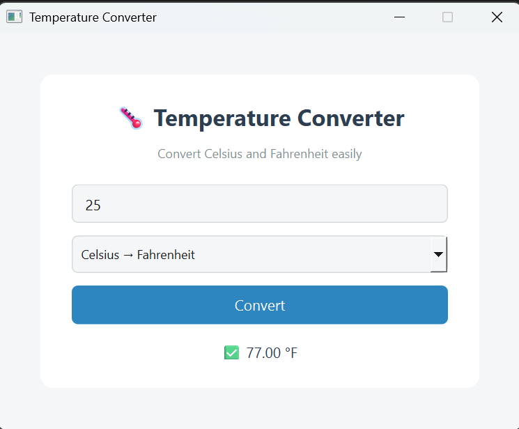

Temperature Converter GUI

A desktop-based graphical application developed as Task 1 for the Prodigy Internship.
The application converts temperature values between Celsius and Fahrenheit using a clean and intuitive user interface, with conversion logic implemented in Go and the GUI built in Python.

✨ Features

🌡 Celsius → Fahrenheit conversion

🌡 Fahrenheit → Celsius conversion

📋 Dropdown-based conversion selection

✅ Accurate results displayed with units

🖥 Clean and user-friendly graphical interface

🛠 Technologies Used

Python – GUI implementation

Go (Golang) – temperature conversion logic

🚀 How to Run

Open the project in your code editor.

Run the Python GUI file.

The Temperature Converter window will open.

Enter a temperature value, select the conversion type, and click Convert.

📸 Screenshot

📌 Notes

This project demonstrates integration between backend logic (Go) and a frontend GUI (Python).

Designed with clarity, usability, and correctness in mind.

🧠 Author
